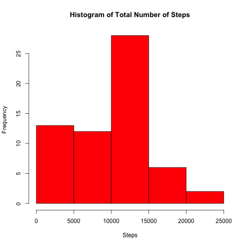
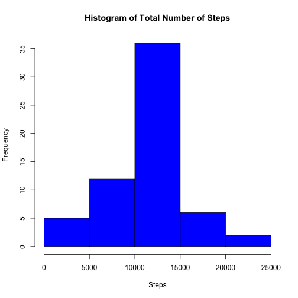
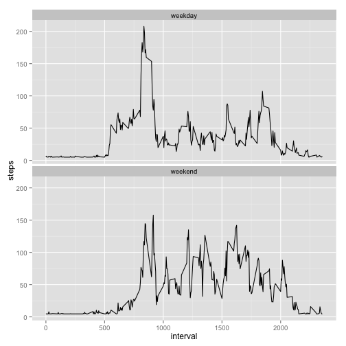

## Loading and preprocessing the data

### Load the data


```r
getwd()
```

```
## [1] "/Users/tcs/ds/RR"
```

```r
x <- read.csv("activity.csv")
```

## What is mean total number of steps taken per day?

### Make a histogram of the total number of steps taken each day


```r
aggdata <-aggregate(x$steps,by=list(x$date),FUN=sum,na.rm=TRUE)
hist(aggdata$x,main="Histogram of Total Number of Steps",xlab="Steps",col = "RED")
```

 

### Calculate and report the mean and median total number of steps taken per day


```r
# Mean of total number of steps
aggregate(x$steps,by=list(x$date),FUN=mean,na.rm=TRUE)
```

```
##       Group.1          x
## 1  2012-10-01        NaN
## 2  2012-10-02  0.4375000
## 3  2012-10-03 39.4166667
## 4  2012-10-04 42.0694444
## 5  2012-10-05 46.1597222
## 6  2012-10-06 53.5416667
## 7  2012-10-07 38.2465278
## 8  2012-10-08        NaN
## 9  2012-10-09 44.4826389
## 10 2012-10-10 34.3750000
## 11 2012-10-11 35.7777778
## 12 2012-10-12 60.3541667
## 13 2012-10-13 43.1458333
## 14 2012-10-14 52.4236111
## 15 2012-10-15 35.2048611
## 16 2012-10-16 52.3750000
## 17 2012-10-17 46.7083333
## 18 2012-10-18 34.9166667
## 19 2012-10-19 41.0729167
## 20 2012-10-20 36.0937500
## 21 2012-10-21 30.6284722
## 22 2012-10-22 46.7361111
## 23 2012-10-23 30.9652778
## 24 2012-10-24 29.0104167
## 25 2012-10-25  8.6527778
## 26 2012-10-26 23.5347222
## 27 2012-10-27 35.1354167
## 28 2012-10-28 39.7847222
## 29 2012-10-29 17.4236111
## 30 2012-10-30 34.0937500
## 31 2012-10-31 53.5208333
## 32 2012-11-01        NaN
## 33 2012-11-02 36.8055556
## 34 2012-11-03 36.7048611
## 35 2012-11-04        NaN
## 36 2012-11-05 36.2465278
## 37 2012-11-06 28.9375000
## 38 2012-11-07 44.7326389
## 39 2012-11-08 11.1770833
## 40 2012-11-09        NaN
## 41 2012-11-10        NaN
## 42 2012-11-11 43.7777778
## 43 2012-11-12 37.3784722
## 44 2012-11-13 25.4722222
## 45 2012-11-14        NaN
## 46 2012-11-15  0.1423611
## 47 2012-11-16 18.8923611
## 48 2012-11-17 49.7881944
## 49 2012-11-18 52.4652778
## 50 2012-11-19 30.6979167
## 51 2012-11-20 15.5277778
## 52 2012-11-21 44.3993056
## 53 2012-11-22 70.9270833
## 54 2012-11-23 73.5902778
## 55 2012-11-24 50.2708333
## 56 2012-11-25 41.0902778
## 57 2012-11-26 38.7569444
## 58 2012-11-27 47.3819444
## 59 2012-11-28 35.3576389
## 60 2012-11-29 24.4687500
## 61 2012-11-30        NaN
```

```r
# Median of total number of steps
aggregate(x$steps,by=list(x$date),FUN=median,na.rm=TRUE)
```

```
##       Group.1  x
## 1  2012-10-01 NA
## 2  2012-10-02  0
## 3  2012-10-03  0
## 4  2012-10-04  0
## 5  2012-10-05  0
## 6  2012-10-06  0
## 7  2012-10-07  0
## 8  2012-10-08 NA
## 9  2012-10-09  0
## 10 2012-10-10  0
## 11 2012-10-11  0
## 12 2012-10-12  0
## 13 2012-10-13  0
## 14 2012-10-14  0
## 15 2012-10-15  0
## 16 2012-10-16  0
## 17 2012-10-17  0
## 18 2012-10-18  0
## 19 2012-10-19  0
## 20 2012-10-20  0
## 21 2012-10-21  0
## 22 2012-10-22  0
## 23 2012-10-23  0
## 24 2012-10-24  0
## 25 2012-10-25  0
## 26 2012-10-26  0
## 27 2012-10-27  0
## 28 2012-10-28  0
## 29 2012-10-29  0
## 30 2012-10-30  0
## 31 2012-10-31  0
## 32 2012-11-01 NA
## 33 2012-11-02  0
## 34 2012-11-03  0
## 35 2012-11-04 NA
## 36 2012-11-05  0
## 37 2012-11-06  0
## 38 2012-11-07  0
## 39 2012-11-08  0
## 40 2012-11-09 NA
## 41 2012-11-10 NA
## 42 2012-11-11  0
## 43 2012-11-12  0
## 44 2012-11-13  0
## 45 2012-11-14 NA
## 46 2012-11-15  0
## 47 2012-11-16  0
## 48 2012-11-17  0
## 49 2012-11-18  0
## 50 2012-11-19  0
## 51 2012-11-20  0
## 52 2012-11-21  0
## 53 2012-11-22  0
## 54 2012-11-23  0
## 55 2012-11-24  0
## 56 2012-11-25  0
## 57 2012-11-26  0
## 58 2012-11-27  0
## 59 2012-11-28  0
## 60 2012-11-29  0
## 61 2012-11-30 NA
```

## What is the average daily activity pattern?

### Make a time series plot (i.e. type = "l") of the 5-minute interval (x-axis) and the average number of steps taken, averaged across all days (y-axis)


```r
aggdata <-aggregate(x$steps,by=list(x$interval),FUN=mean,na.rm=TRUE)
plot(aggdata$Group.1,aggdata$x,type="l",xlab="Interval",ylab="Average Steps Taken")
```

 

### Which 5-minute interval, on average across all the days in the dataset, contains the maximum number of steps?

```r
aggdata <-aggregate(x$steps,by=list(x$interval),FUN=mean,na.rm=TRUE)
aggdata[which.max(aggdata$x),]
```

```
##     Group.1        x
## 104     835 206.1698
```

```r
# The interval is 835
```

## Imputing missing values

### Calculate and report the total number of missing values in the dataset (i.e. the total number of rows with NAs)


```r
sum(is.na(x))
```

```
## [1] 2304
```

```r
# The total number of missing values is 2304
```

### Devise a strategy for filling in all of the missing values in the dataset. The strategy does not need to be sophisticated. For example, you could use the mean/median for that day, or the mean for that 5-minute interval, etc.


```r
# Get the mean value for each day
aggdata <-aggregate(x$steps,by=list(x$date),FUN=mean,na.rm=TRUE)
```

### Create a new dataset that is equal to the original dataset but with the missing data filled in.


```r
names(aggdata) <- c("date", "Mean")
# Merge x(original data set) and aggdata(data set with mean values for each day) to add a column Mean
xxx <- merge(x,aggdata,by="date")

# Replace all NA values from "steps" from "Mean" column
xxx$steps[is.na(xxx$steps)] <- xxx$Mean[is.na(xxx$Mean)]

# Replace all NA values with overall mean values for all dates that has no steps values like "2012-10-01"
xxx[is.na(xxx)] <- mean(xxx$steps,na.rm=TRUE)

# Make equivalent data set with all NA values replaced
dataset <- data.frame(xxx$steps,xxx$date,xxx$interval)
names(dataset) <- c("steps", "date","interval")
dim(dataset)
```

```
## [1] 17568     3
```

### Make a histogram of the total number of steps taken each day and Calculate and report the mean and median total number of steps taken per day. Do these values differ from the estimates from the first part of the assignment? What is the impact of imputing missing data on the estimates of the total daily number of steps?


```r
aggdata <-aggregate(dataset$steps,by=list(dataset$date),FUN=sum,na.rm=TRUE)
hist(aggdata$x,main="Histogram of Total Number of Steps",xlab="Steps",col = "BLUE")
```

 

## Are there differences in activity patterns between weekdays and weekends?

### Create a new factor variable in the dataset with two levels – “weekday” and “weekend” indicating whether a given date is a weekday or weekend day.


```r
dataset$day <- ifelse(weekdays(as.Date(dataset$date)) %in% c("Saturday","Sunday"),"weekend", "weekday")
```

### Make a panel plot containing a time series plot (i.e. type = "l") of the 5-minute interval (x-axis) and the average number of steps taken, averaged across all weekday days or weekend days (y-axis).


```r
library(ggplot2)
ggplot(dataset, aes(x = interval, y = steps, group = day)) +
geom_line() +
facet_wrap( ~ day,nrow=2) 
```

 


